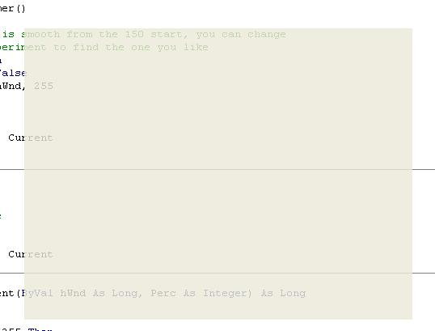



## Faded Splash Form

### Description

Just a simple Splash screen that fades in Via the Alpha transparency. This is intended to be put into your \Templates\Forms\ directory so that you can simply Add>Forms>Fading Splash Form
 
### More Info
 
Will slow down system.

             |
---                |---
**Submitted On**   |2003-06-14 01:04:46
**By**             |[Sean  Gallardy](https://github.com/Planet-Source-Code/PSCIndex/blob/master/ByAuthor/sean-gallardy.md)
**Level**          |Intermediate
**User Rating**    |4.7 (14 globes from 3 users)
**Compatibility**  |VB 6\.0
**Category**       |[Custom Controls/ Forms/  Menus](https://github.com/Planet-Source-Code/PSCIndex/blob/master/ByCategory/custom-controls-forms-menus__1-4.md)
**World**          |[Visual Basic](https://github.com/Planet-Source-Code/PSCIndex/blob/master/ByWorld/visual-basic.md)
**Archive File**   |[Faded\_Spla1600816142003\.zip](https://github.com/Planet-Source-Code/sean-gallardy-faded-splash-form__1-46172/archive/master.zip)

### API Declarations

In the project.

